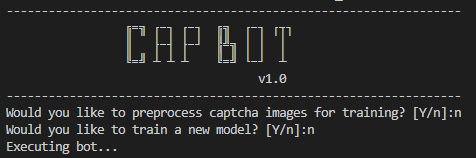

<!-- PROJECT SHIELDS -->
<!--
*** I'm using markdown "reference style" links for readability.
*** Reference links are enclosed in brackets [ ] instead of parentheses ( ).
*** See the bottom of this document for the declaration of the reference variables
*** for contributors-url, forks-url, etc. This is an optional, concise syntax you may use.
*** https://www.markdownguide.org/basic-syntax/#reference-style-links
-->

[![Contributors][contributors-shield]][contributors-url]
[![Forks][forks-shield]][forks-url]
[![Stargazers][stars-shield]][stars-url]
[![Issues][issues-shield]][issues-url]
[![MIT License][license-shield]][license-url]
[![LinkedIn][linkedin-shield]][linkedin-url]

<!-- PROJECT LOGO -->
<br />
<p align="center">
  <a href="https://github.com/reevesba/captcha-bot">
    
  </a>

  <h3 align="center">CapBot</h3>

  <p align="center">
    Solve Captchas w/ Machine Learning and Selenium
    <br />
    <a href="https://reevesba.github.io/captcha-bot/#doc"><strong>Explore the docs »</strong></a>
    <br />
    <br />
    <a href="https://github.com/reevesba/captcha-bot">View Demo</a>
    ·
    <a href="https://github.com/reevesba/captcha-bot/issues">Report Bug</a>
    ·
    <a href="https://github.com/reevesba/captcha-bot/issues">Request Feature</a>
  </p>
</p>

<!-- TABLE OF CONTENTS -->
## Table of Contents
* [About the Project](#about-the-project)
  * [Built With](#built-with)
* [Getting Started](#getting-started)
  * [Prerequisites](#prerequisites)
  * [Installation](#installation)
* [Usage](#usage)
* [Roadmap](#roadmap)
* [Contributing](#contributing)
* [License](#license)
* [Contact](#contact)

<!-- ABOUT THE PROJECT -->
## About The Project
This project aims to demonstrate how a captcha can be bypassed using a bot and machine learning methods. The captcha being fooled is [Really Simple CAPTCHA](https://wordpress.org/plugins/really-simple-captcha/). As noted on the site and implied by the name, this captcha is really simple and doesn't provide a strong level of security. Even so, this is a popular WordPress plugin with 700,000+ active installations :fearful:.

### Built With
* [Keras](https://keras.io/)
* [OpenCV](https://docs.opencv.org/master/index.html)
* [scikit-learn](https://scikit-learn.org/stable/)
* [NumPy](https://numpy.org/doc/stable/contents.html)
* [Selenium](https://www.selenium.dev/)
* [Bootstrap](https://getbootstrap.com/)

<!-- GETTING STARTED -->
## Getting Started
This project can be easily cloned and executed locally. Prior to running the python script, I recommend checking out the [website](https://reevesba.github.io/captcha-bot/) containing the captcha first. This way you can get a feel for how the captcha works and what the bot may be trying to accomplish. 

### Prerequisites
This project requires Python (I am using Python 3.8.5) to be installed along with several Python modules. These modules can be found in [requirements.txt](requirements.txt). 

To install the modules, simply execute the following command in the base directory.
```sh
pip3 install -r requirements.txt
```

In addition, [Google Chrome](https://www.google.com/chrome/) and [ChromeDriver](https://chromedriver.chromium.org/downloads) will need to be installed. The instructions provided here pertain to Debian based systems.
```sh
# Installing Chrome
# First, install Chrome dependencies
sudo apt-get update
sudo apt-get install -y curl unzip xvfb libxi6 libgconf-2-4

# Next, install Chrome
wget https://dl.google.com/linux/direct/google-chrome-stable_current_amd64.deb
sudo apt install ./google-chrome-stable_current_amd64.deb

# Validate installation
google-chrome --version

# Installing ChromeDriver
# Note, use the ChromeDriver url that matches your Chrome version
wget https://chromedriver.storage.googleapis.com/86.0.4240.22/chromedriver_linux64.zip
unzip chromedriver_linux64.zip
sudo mv chromedriver /usr/bin/chromedriver
sudo chown root:root /usr/bin/chromedriver
sudo chmod +x /usr/bin/chromedriver

# Validate installation
chromedriver --version
```

If you are using WSL2, you must also install an X server. First, download and install [VcXsrv](https://sourceforge.net/projects/vcxsrv/). Once installed, run xlaunch.exe. You can use most of the default settings, but make sure to check "Disable access control". Finally, set the DISPLAY to the correct ip address.
```sh
export DISPLAY=$(cat /etc/resolv.conf | grep nameserver | awk '{print $2; exit;}'):0.0
```

To prevent having to export DISPLAY for each session, add this line to your .bashrc file.

### Installation

1. Clone the repo
    ```sh
    git clone https://github.com/reevesba/captcha-bot
    cd captcha-bot
    ```
2. Install Python packages
    ```sh
    pip3 install -r requirements.txt
    ```
3. Extract the images in dat/captchas.zip

<!-- USAGE EXAMPLES -->
## Usage
Executing this bot is very simple. There are three primary modules included. The first preprocesses images of captchas by extracting each character from the captcha and saving them as new images. The second module creates a convolutional neural network with Keras and trains the model. The final module executes the bot. The bot will open the webpage, enter the captcha guess, and submit. 

The first step is to execute the driver program. 
```sh
cd src
python3 main.py
```

You will be met with an interactive command line interface. 

<p align="center"><a href="https://github.com/reevesba/captcha-bot">
    
</a></p>

If you have already preprocessed the captcha images, you can skip the preprocessing step by entering 'n'. Similiarily, if you have already trained the network and saved the weights, you can skip the training step by entering 'n'.

Once the first two steps are complete, the bot will attempt to break the captcha.

<!-- ROADMAP -->
## Roadmap
See the [open issues](https://github.com/reevesba/captcha-bot/issues) for a list of proposed features (and known issues).

<!-- CONTRIBUTING -->
## Contributing
Contributions are what make the open source community such an amazing place to be learn, inspire, and create. Any contributions you make are **greatly appreciated**.

1. Fork the Project
2. Create your Feature Branch (`git checkout -b feature/AmazingFeature`)
3. Commit your Changes (`git commit -m 'Add some AmazingFeature'`)
4. Push to the Branch (`git push origin feature/AmazingFeature`)
5. Open a Pull Request

<!-- LICENSE -->
## License
Distributed under the GNU GPLv3 License. See `LICENSE` for more information.

<!-- CONTACT -->
## Contact
Bradley Reeves - reevesbra@outlook.com

Project Link: [https://github.com/reevesba/captcha-bot](https://github.com/reevesba/captcha-bot)

<!-- ACKNOWLEDGEMENTS
## Acknowledgements
* [GitHub Emoji Cheat Sheet](https://www.webpagefx.com/tools/emoji-cheat-sheet)
* [Img Shields](https://shields.io)
* [Choose an Open Source License](https://choosealicense.com)
* [GitHub Pages](https://pages.github.com)
* [Animate.css](https://daneden.github.io/animate.css)
* [Loaders.css](https://connoratherton.com/loaders)
* [Slick Carousel](https://kenwheeler.github.io/slick)
* [Smooth Scroll](https://github.com/cferdinandi/smooth-scroll)
* [Sticky Kit](http://leafo.net/sticky-kit)
* [JVectorMap](http://jvectormap.com)
* [Font Awesome](https://fontawesome.com)
-->

<!-- MARKDOWN LINKS & IMAGES -->
<!-- https://www.markdownguide.org/basic-syntax/#reference-style-links -->
[contributors-shield]: https://img.shields.io/github/contributors/reevesba/captcha-bot?style=plastic
[contributors-url]: https://github.com/reevesba/captcha-bot/graphs/contributors
[forks-shield]: https://img.shields.io/github/forks/reevesba/captcha-bot?style=plastic
[forks-url]: https://github.com/reevesba/captcha-bot/network/members
[stars-shield]: https://img.shields.io/github/stars/reevesba/captcha-bot?style=plastic
[stars-url]: https://github.com/reevesba/captcha-bot/stargazers
[issues-shield]: https://img.shields.io/github/issues/reevesba/captcha-bot?style=plastic
[issues-url]: https://github.com/reevesba/captcha-bot/issues
[license-shield]: https://img.shields.io/github/license/reevesba/captcha-bot?style=plastic
[license-url]: https://github.com/reevesba/captcha-bot/blob/main/LICENSE
[linkedin-shield]: https://img.shields.io/badge/-LinkedIn-black.svg?style=plastic&logo=linkedin&colorB=555
[linkedin-url]: https://www.linkedin.com/in/bareeves/
[product-screenshot]: images/screenshot.png